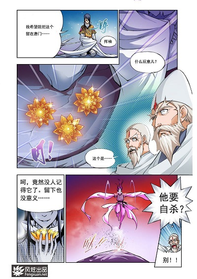
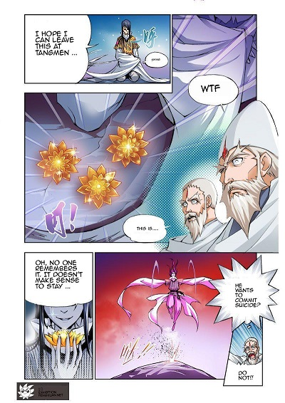

# mangatranslation
PHP manga automatic translator (Works with Google Cloud Platform)

CPU Only, no cuda, no opencv, no machine learning

## Warning
* In order to get acceptable result, your manga/comic raw quality has to be perfect!! 
* Google translate work well when translated from chinese(manhua), but not so well from Japanese(Manga)

## Translation examples

### Source


### Translated


## Workflow summary
* Open image (jpeg, png, gif or bmp)
* Detect textboxes
* Detect font size
* OCR Text in textboxes
* Remove old text from textboxes
* Use Google API to translate
* Expand textboxes if possible
* Adapt translation font size to fit in textboxes
* write translation in the corresponding textboxes
* export image

## Known Issues
* Let me know

## Installation

create a composer.json file in your project, and add:

```json
{
    "minimum-stability": "dev",
    "require": {
         "hcharbonnier/mangatranslation": ">=0.99.0"
    }
}
```

then install depedencies:
```sh
composer install
```
## Requirement
* php-7.4 (not tested with php<7.4 but could work)
* php-gd
* bcmath
* A google cloud platform project configured
 (https://cloud.google.com/dataproc/docs/guides/setup-project)

## Dev additionnal requirements

* php-7.4-xml
* php-7.4-xmlrpc
* php-7.4-mbstring

## Example
```php
<?php
require_once __DIR__ . '/vendor/autoload.php'; // Autoload files using Composer autoload

use mangatranslation\MangaImage;
use mangatranslation\TextBlock;

$trans=new MangaImage($argv[1]);
$trans->detect_block();
$trans->merge_near_block();
$trans->ocr();
$trans->translate();
$trans->clean_raw();
$trans->write_translation();
$trans->export($argv[2],90);

```
Then run:
```sh
$ export GOOGLE_APPLICATION_CREDENTIALS=PATH_TO_GOOGLE_PROJECT.json
$ php example.php image.jpg translated.jpg
```

## Extra features
Mangatranslation can be integrated with a custom frontend to perform better translation.
This functions allow user to interact with the process:

### Get list of textbox
```php
$trans->get_blocks() : array
```
### Manually specify additional a textbox
```php
$trans->add_block($x1,$y1,$x2,$y2,$x3,$y3,$x4,$y4) : void
```
### Get translation of textbox $id_block
```php
$trans->get_block_translation(int $id_block) : string
```
### Manually specify translation
```php
//to be call BEFORE translate() !!!
$trans->set_block_translation(6,"Translated text") : void
```
### Manually specify cleaned raw image
```php
$trans->set_cleaned_raw("toto_clean.jpg") : void

```